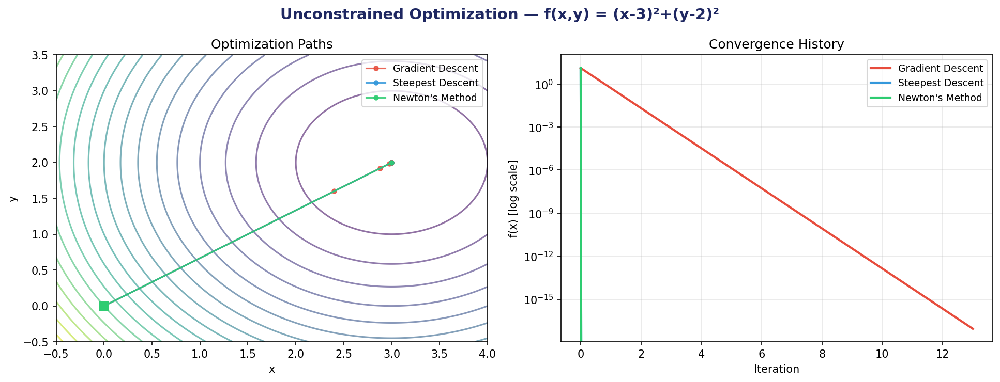
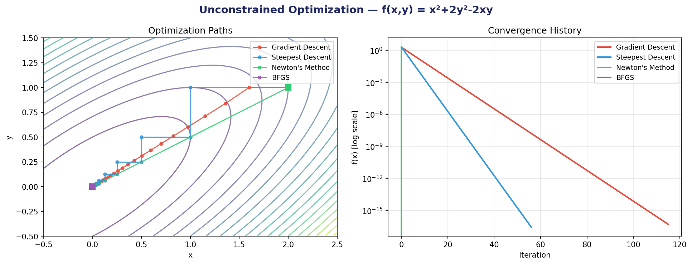
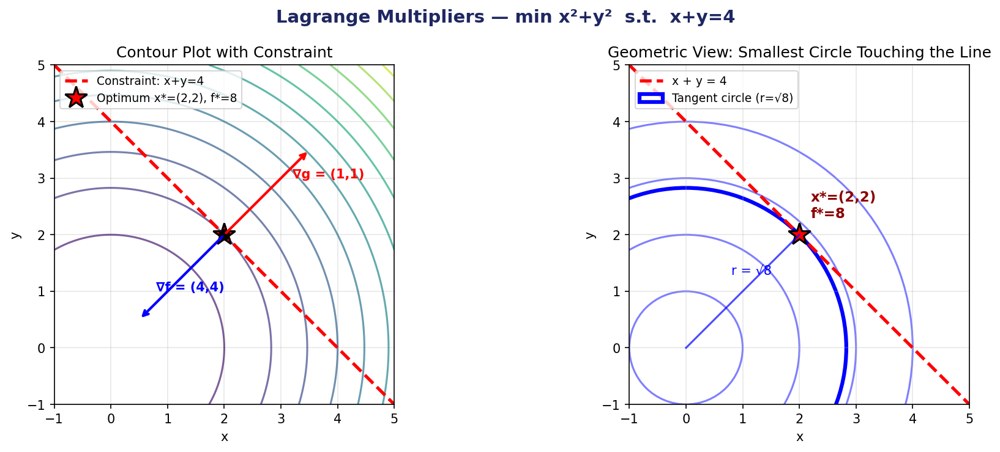
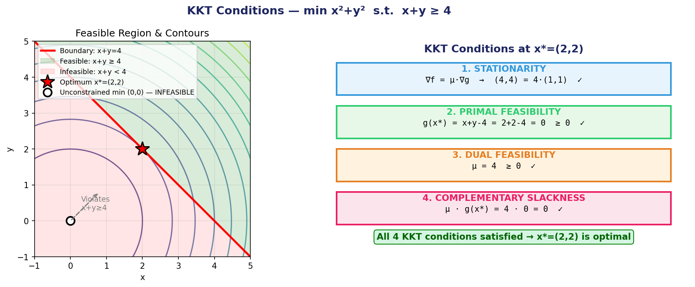
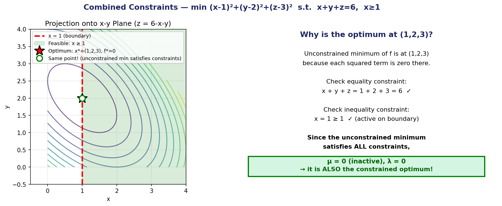

# Optimization Techniques — Python Implementation

A comprehensive Python implementation and visualization of classical optimization algorithms covering both **unconstrained** and **constrained** optimization methods.

---

## 📋 Table of Contents

- [Overview](#overview)
- [Algorithms Implemented](#algorithms-implemented)
- [Requirements](#requirements)
- [Usage](#usage)
- [Results & Visualizations](#results--visualizations)
  - [Unconstrained Optimization](#unconstrained-optimization)
  - [Constrained Optimization](#constrained-optimization)

---

## 🎯 Overview

This project demonstrates and compares fundamental optimization algorithms through numerical examples and visualizations. It covers:

- **4 Unconstrained Methods**: Gradient Descent, Steepest Descent, Newton's Method, BFGS
- **3 Constrained Methods**: Lagrange Multipliers, KKT Conditions, Combined Equality & Inequality Constraints

Each algorithm is implemented from scratch in NumPy and verified against SciPy's reference implementations.

---

## 🧮 Algorithms Implemented

### Unconstrained Optimization

| Algorithm | Order | Convergence | Key Feature |
|-----------|-------|-------------|-------------|
| **Gradient Descent** | 1st | Linear | Fixed step size (learning rate) |
| **Steepest Descent** | 1st | Linear | Armijo backtracking line search |
| **Newton's Method** | 2nd | Quadratic | Uses full Hessian matrix |
| **BFGS** | 2nd | Superlinear | Approximates Hessian iteratively |

### Constrained Optimization

| Method | Constraint Type | Key Concept |
|--------|----------------|-------------|
| **Lagrange Multipliers** | Equality (`=`) | Stationarity of Lagrangian |
| **KKT Conditions** | Inequality (`≥`, `≤`) | Dual feasibility & complementary slackness |
| **Combined** | Both | Active/inactive constraint analysis |

---

## 📦 Requirements

```bash
pip install numpy scipy matplotlib
```

- Python 3.8+
- NumPy
- SciPy
- Matplotlib

---

## 🚀 Usage

Run the main script to execute all algorithms and generate visualizations:

```bash
python optimization_complete.py
```

This will:
1. Run all 7 algorithms with numerical output to console
2. Generate 5 high-resolution plots saved as PNG files

---

## 📊 Results & Visualizations

All generated figures are saved in the `outputs/` folder.

---

### Unconstrained Optimization

#### Figure 1: Spherical Bowl — `f(x,y) = (x-3)² + (y-2)²`



**Observations:**
- **Newton's Method** (green): Converges in **1 iteration** — exact for quadratics
- **Steepest Descent** (blue): Also converges in **1 iteration** for perfectly conditioned (κ=1) spherical quadratics — path overlaps with Newton
- **Gradient Descent** (red, α=0.1): Takes **~93 iterations** with linear convergence

> 💡 *The blue line is hidden behind the green line because both methods take the exact same single step to the minimum on a spherical bowl.*

---

#### Figure 2: Elongated Valley — `f(x,y) = x² + 2y² - 2xy`



**Observations:**
- **Newton's Method** (green): **1 iteration** — again exact
- **BFGS** (purple): **3 iterations** — quickly builds Hessian approximation then jumps to minimum
- **Steepest Descent** (blue): **57 iterations** with classic **zigzag (hemstitching)** pattern due to ill-conditioning (κ ≈ 6.85)
- **Gradient Descent** (red, α=0.2): **~115 iterations** — slowest but simplest

> 🔑 *The zigzag pattern is the defining visual feature of steepest descent on ill-conditioned problems. Each search direction is orthogonal to the previous one.*

---

### Constrained Optimization

#### Figure 3: Lagrange Multipliers — Equality Constraint

**Problem:** `min x² + y²` subject to `x + y = 4`



**Key Insights:**
- **Left**: The gradient of the objective `∇f = (4,4)` is parallel to the gradient of the constraint `∇g = (1,1)` at the optimum — this is the Lagrange condition `∇f = λ∇g`
- **Right**: Geometric interpretation as finding the smallest circle centered at the origin that touches the constraint line
- **Solution:** `x* = (2, 2)`, `λ* = 4`, `f* = 8`

---

#### Figure 4: KKT Conditions — Inequality Constraint

**Problem:** `min x² + y²` subject to `x + y ≥ 4`



**Key Insights:**
- **Left**: The unconstrained minimum `(0,0)` lies in the **infeasible region** (red), so it is rejected
- The constrained optimum `(2,2)` sits exactly on the **boundary** where `x + y = 4`
- **Right**: All **4 KKT conditions** are verified:
  1. **Stationarity**: `∇f = μ∇g` → `(4,4) = 4·(1,1)` ✓
  2. **Primal Feasibility**: `g(x*) = 0 ≥ 0` ✓
  3. **Dual Feasibility**: `μ = 4 ≥ 0` ✓
  4. **Complementary Slackness**: `μ·g(x*) = 4·0 = 0` ✓

---

#### Figure 5: Combined Constraints — Equality + Inequality

**Problem:** `min (x-1)² + (y-2)² + (z-3)²` subject to `x + y + z = 6`, `x ≥ 1`



**Key Insights:**
- The **unconstrained minimum** `(1, 2, 3)` happens to satisfy **both constraints automatically**
- Equality: `1 + 2 + 3 = 6` ✓
- Inequality: `x = 1 ≥ 1` ✓ (active on boundary)
- Since the unconstrained optimum is feasible, it is **also the constrained optimum**
- Both Lagrange multipliers are zero: `λ = 0`, `μ = 0`

---

